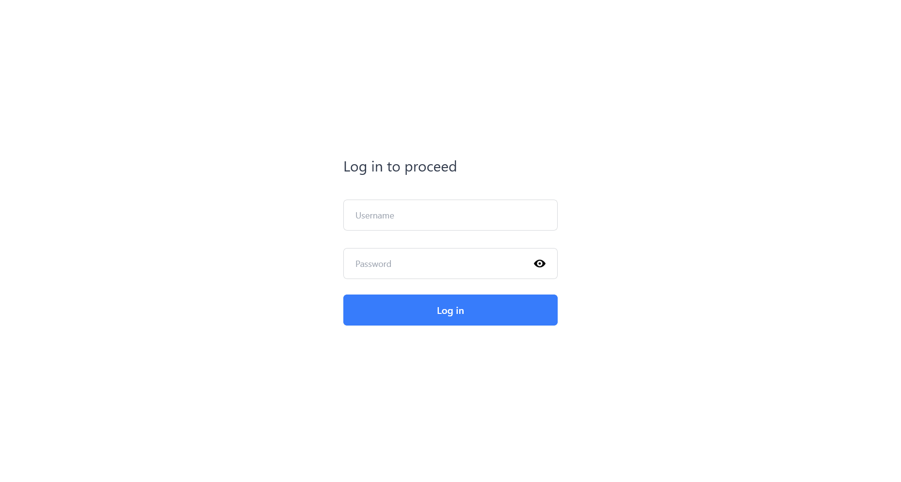
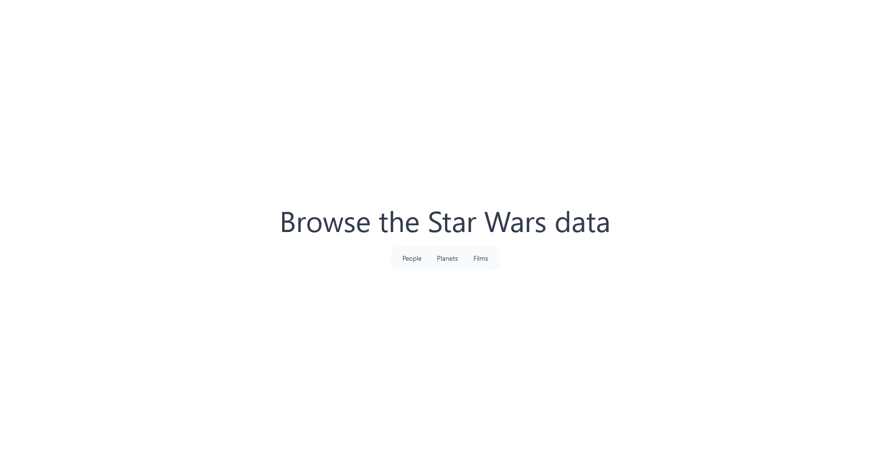
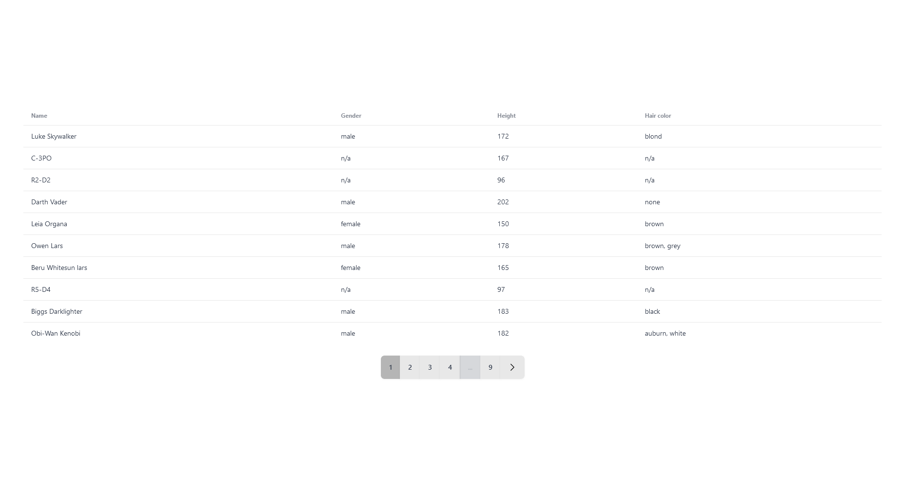
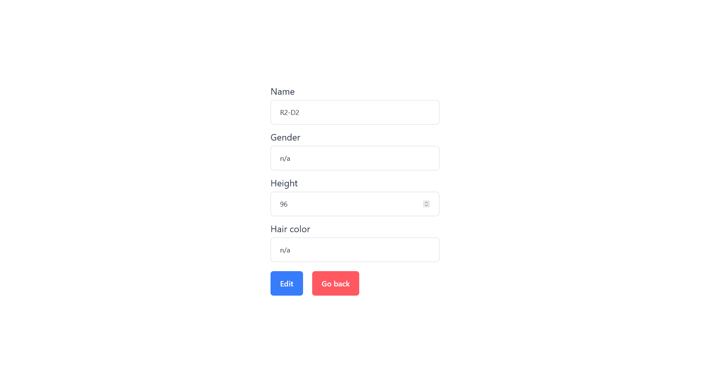

# Тестовое задание для позиции Junior Front-End Developer, Solva Technology

# Usage

*Requirements*

- node.js
- npm

Clone the repository and cd:

```
git clone https://github.com/erasy1L/swapi-react
cd swapi-react
```

- Run with: ``npm run dev``

# Used libraries

- [react-hook-form](https://github.com/react-hook-form/react-hook-form)
- [react-redux](https://github.com/reduxjs/react-redux)
- [react-router](https://github.com/remix-run/react-router)
- [daisyui](https://github.com/saadeghi/daisyui)

# Features

Separate page for table of three subjects from [SWAPI](https://swapi.dev/)

- https://swapi.dev/api/people/
- https://swapi.dev/api/planets/
- https://swapi.dev/api/films/

## Log in page



## Dashboard



## Table of subjects



## Subject page


